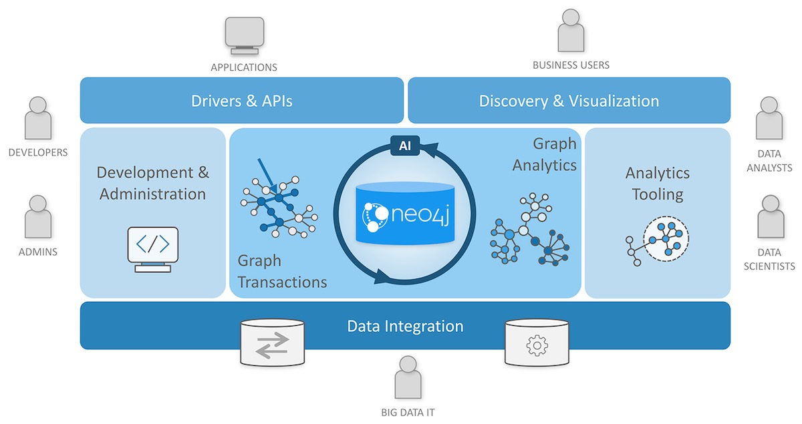
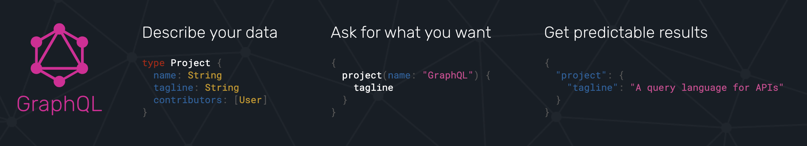
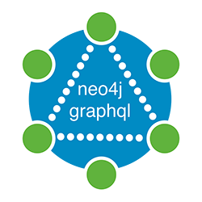

# Intro To Neo4j GraphQL

## Overview

In this module we

## What is Neo4j?

Neo4j is a native graph database with many features and functionality making up the Neo4j Graph Platform. Specifically:

* The Neo4j DBMS
* The property graph data model
* The Cypher query language
* Language drivers using the Bolt protocol for building applications
* Graph analytics with Graph Data Science
* Data visualization with Neo4j Bloom
* Neo4j Aura database-as-a-service
* A GraphQL integration for building GraphQL APIs backed by Neo4j

## What is GraphQL?

GraphQL is an API query language and runtime for fulfilling those queries. GraphQL uses a type system to define the data available in the API, including what entities and attributes (*types* and *fields* in GraphQL parlance) exist and how types are connected (the data graph). GraphQL operations (queries, mutations, or subscriptions) specify an entry-point and a traversal of the data graph (the *selection set*) which defines what fields to be returned by the operation.

### Important GraphQL Concepts

#### GraphQL Type Definitions

#### GraphQL Operations

#### The Selection Set

// TODO: selection set, resolvers, operations, type definitions

### Benefits of GraphQL

Some of the benefits of GraphQL include:

* **Overfetching** - sending less data over the wire
* **Underfetching** - everything the client needs in a single request
* The **GraphQL specification** defines exactly what GraphQL is
* **Simplify data fetching** with component based data interactions
* **"Graphs all the way down"** - GraphQL can help unify disparate systems and focus API interactions on relationships instead of resources.
* **Developer productivity** - By reasoning about application data as a graph with a strict type system developers can focus on building applications.

### GraphQL Challenges

Of course GraphQL is not a silver bullet. It's important to be aware of some of the challenges that come from introducing GraphQL in a system.

* Some well understood practices from REST don't apply
    * HTTP status codes
    * Error handling
    * Caching
* Exposing arbitrary complexity to the client and performance considerations
* The n+1 query problem - the nested nature of GraphQL operations can lead to multiple requests to the data layer(s) to resolve a request
* Query costing and rate limiting

Best practices and tooling have emerged to address all of the above, however it's important to be aware of these challenges.

## What is Neo4j GraphQL?

The fundamental goal of the Neo4j GraphQL integrations is to make it easier to build GraphQL APIs backed by Neo4j.

> NOTE: It's important to point out that GraphQL is an API query language and NOT a database query language. The goal of the Neo4j GraphQL integration is to help build the API layer that sits between the client and database, not to execute GraphQL queries directly against the database.

At a high level the goals are:

* Reduce boilerplate
* Developer productivity
* Extensible
* Performance

### Goals of Neo4j GraphQL

#### GraphQL First Development

#### Generate Cypher From GraphQL Operations

#### G

## Neo4j GraphQL Implementations

There are

### `neo4j-graphql.js`

## Exploring The Movies GraphQL API

### Exercise ⏲️ `15 minutes`

To familiarize yourself with GraphQL and writing GraphQL queries, explore the public movies GraphQL API at https://movies.grandstack.io. Open the URL in a web browser to access GraphQL Playground and explore the DOCS and SCHEMA tab to see the type definitions.

Try writing queries to answer the following questions:

1. Find the titles of the first 10 movies, ordered by title.
1. Who acted in the movie "Jurassic Park"?
1. What are the genres of "Jurassic Park"? What other movies are in those genres?
1. What movie has the highest imdbRating?

## GraphQL Architect For Neo4j Desktop

### Overview

### Installation

### Exercise ⏲️ `10 minutes`

Install, connect to Neo4j Recommendations sandbox.

### The Neo4j GraphQL API

### `@cypher` Schema Directive

### Exercise ⏲️ `10 minutes`

Add a movie recommendation query

