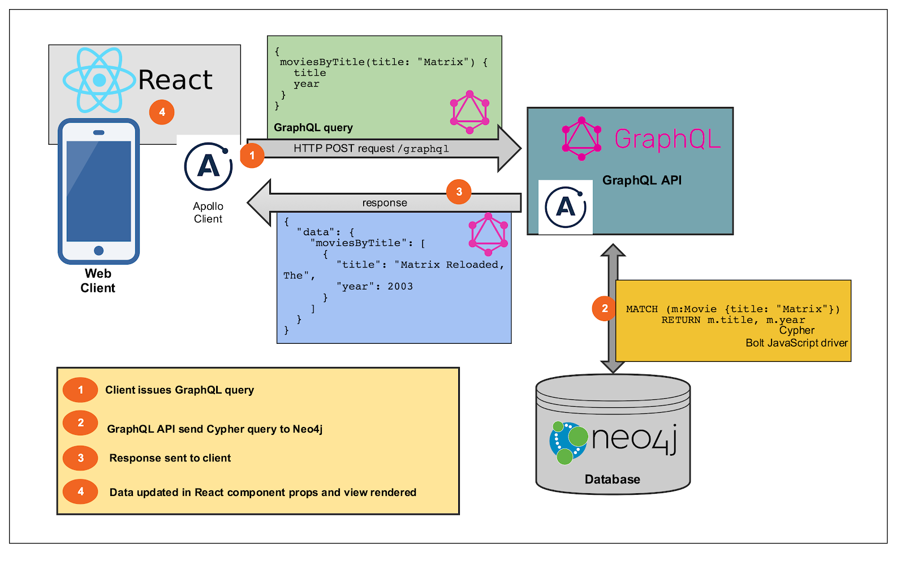
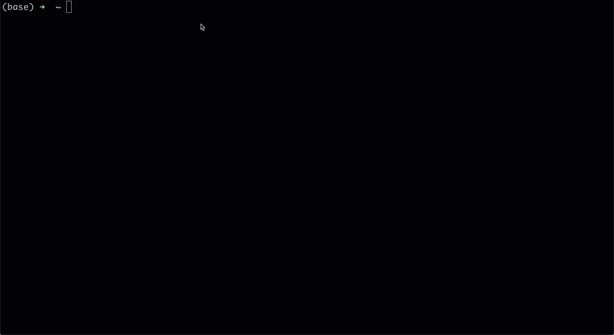
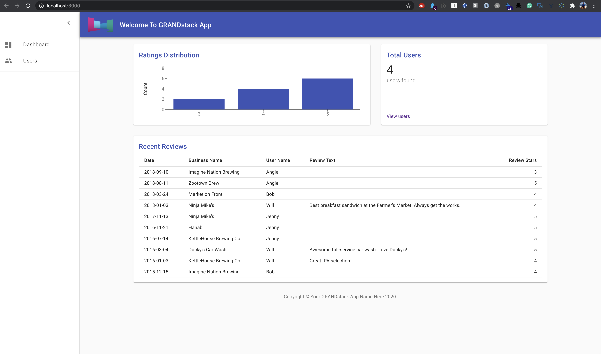
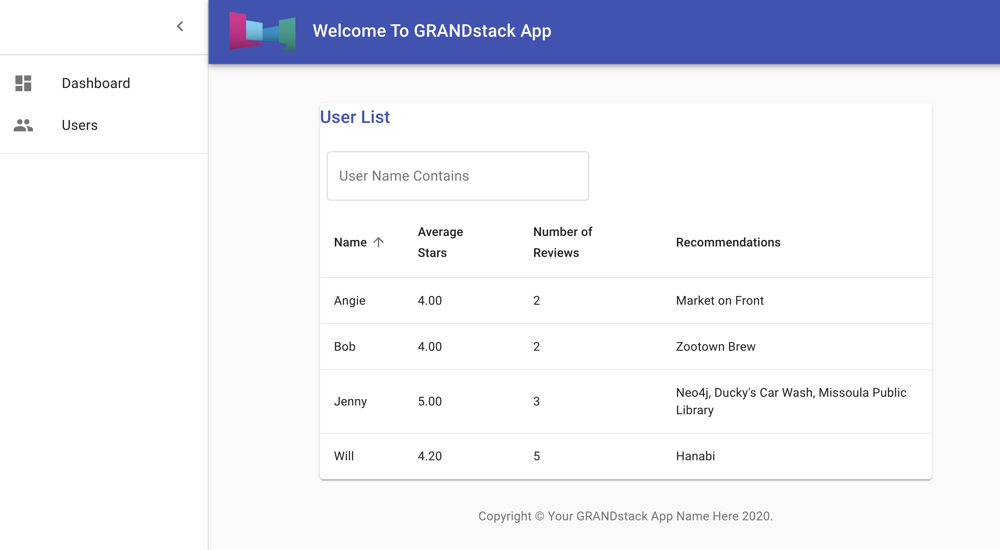

# GRANDstack

In this module we'll use the `create-grandstack-app` CLI to create a fullstack skeleton application using GraphQL, React, Apollo, and Neo4j Database. We'll then make some updates to the application to convert it to a movies search application using the Recommendations Neo4j Sandbox. Finally, we'll see how to deploy the application to Netlify.

## Overview

A GRANDstack application uses GraphQL, React, Apollo, and Neo4j Database.

## `create-grandstack-app`

The `create-grandstack-app` CLI can be used to create and configure a new GRANDstack application. The skeleton application is a business reviews application.

## Exercise ⏲️ `15 minutes`

Use the `create-grandstack-app` CLI to create a new GRANDstack application connected to your Neo4j Sandbox instance.

* Run the command `npx create-grandstack-app my-new-app` or with yarn `yarn create grandstack-app my-new-app`
* Select the React frontend template
* When prompted enter the connection credentials for your Neo4j Sandbox instance
* Follow the instructions to start the application and open in your browser

You should see something like this:

If you run into any issues running locally, you can use Codesandbox to run the API and React applications:

* [Codesandbox for API application](https://codesandbox.io/s/github/grand-stack/fullstack-graphql-workshop/tree/master/2_GRANDstack/api)
* [Codesandbo for React application](https://codesandbox.io/s/github/grand-stack/fullstack-graphql-workshop/tree/master/2_GRANDstack/web-react)

## Code Walkthrough

Let's take a look at the code! Important things we'll want to note along the way:

* `/api/src`
    * `schema.graphql` - contain the GraphQL type definitions for the API
    * `index.js` - `makeAugmentedSchema` and `ApolloServer`
* `/web-react/src`
    * `index.js` - Creating an ApolloClient instance
    * `App.js` - using Material UI components and react router
    * `components/UserCount.js` - using ApolloClient React hooks
    * `components/UserList.js` - more complex use of `useQuery` (GraphQL variables)

## Exercise ⏲️ `15 minutes`

Let's add the results of our recommendations query to the User search component

* First, in the API replace the current recommendations Cypher query with the one you created in the previous module.
* Next, update `web-react/src/components/UserList.js` to include the recommendations field in the GraphQL query and show recommended businesses for each user in the table.

You should see something like this:

## Deploying To Netlify

Now let's deploy our application using [Netlify](https://www.netlify.com/). Netlify allows use to build and host static content as well as Lambda functions which we'll use to serve our GraphQL API. Netlify has a free tier that will allow us to deploy applications without entering a credit card.

## Exercise ⏲️ `15 minutes`

* Create a new Github repository and push up your GRANDstack application.
* Create a free [Netlify](https://www.netlify.com/) account
* Connect your new GRANDstack application Github repo to Netlify
* Be sure to specify the `NEO4J_URI`, `NEO4J_USER`, and `NEO4J_PASSWORD` environment variables in the Netlify console to connect to your Neo4j Sandbox instance
* Deploy your application!

Alternatively, try the "Deploy to Netlify" or "Deploy to Vercel" buttons from the [GRANDstack Starter Project repository.](https://github.com/grand-stack/grand-stack-starter)

BONUS - Deploy the application using DigitalOcean App Platform.